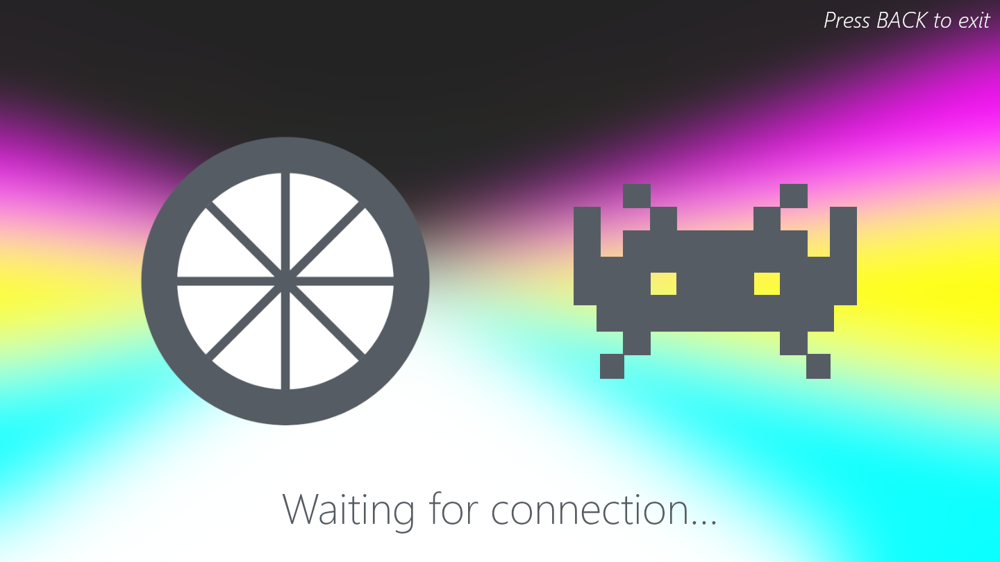
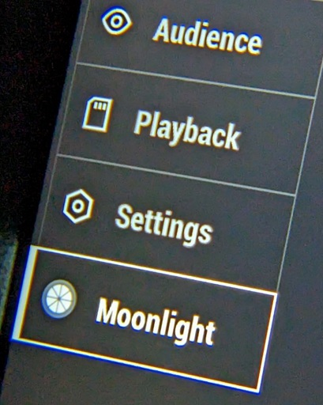

# dji-moonlight-shim

Stream games via Moonlight and [fpv.wtf](https://github.com/fpv-wtf) to your DJI
FPV Goggles. Friend of
[dji-moonlight-embedded](https://github.com/Knifa/dji-moonlight-embedded).



Latency is good, in the 7-14ms range at 120Hz (w/ 5900X + 3080Ti via GE).


## Usage

### Setup

1. Go to [fpv.wtf](https://fpv.wtf/) with your goggles connected and powered up.
2. Update WTFOS and friends to the latest version.
3. Install `dji-moonlight-shim` via the package mangaer.
4. Reboot your goggles.

### Starting

1. Select `Moonlight` from the menu.

    

2. Use [dji-moonlight-embedded](https://github.com/Knifa/dji-moonlight-embedded)
   to stream video to the shim.

### Stopping

1. You can never leave.
2. It will be this way forever.
3. Breathe.
4. ???
5. Reboot your goggles.

### CLI

1. You can also start the shim via ADB.

    ```bash
    $ dji-moonlight-shim

    # You can also force USB mode
    $ dji-moonlight-shim --usb

    # ...or network mode.
    $ dji-moonlight-shim --net
    ```
2. Ctrl-C to stop and restart the glasses service.

## Configuration

The shim can be configured via `package-config`:

- `use_usb_mode`: Use USB mode by default instead of the network mode. Defaults
  to `false`.

## Implementation

Technically, this will accept any Annex B H.264 stream since all this does
really is pipe the stream right into the decoder.

First, it expects a connect header:

```c
struct connect_header_s {
  uint32_t magic; // 0x42069
  uint32_t width;
  uint32_t height;
  uint32_t fps;
}
```

After which, it expects a stream of frames. Each frame should be sent prefixed
with a `uint32_t` length header, followed by the frame data itself.

The maximum frame size is `1MB (1000000 bytes)`, which is slightly under the
maximum packet size for the decoder. Any larger and this would need to handle
packet splitting. But also, this is absolutely enormous for a single frame.

### Network Mode

In network mode, the shim hosts a TCP server on port `42069` that accepts a
single connection at a time. Normal client/server stuff applies here and will
handle reconnections, etc.

### USB Mode

In USB mode, the shim reads from the FunctionFS bulk endpoint already setup by
DJI at `/dev/usb-ffs/bulk/ep1`.

Currently, there's no way to tell if the USB side has connected or disconnected,
so on startup the shim just waits for the magic number to appear in this file,
at which point it assumes it's about to get the rest of the connect header,
followed by the rest of the stream. After that though, it's got no idea.

### Booting

The `dji-moonlight-shim` that gets popped into `/opt/bin` is actually a wrapper
around the actual binary in `/opt/moonlight/`. The glasses service and the shim
can't co-exist so this wrapper handles stopping (and restarting) it.

### Decoder

Everything around decoding lives in [dmi](./src/dmi) and is probably the best
way to understand how this works. Start from [dmi_pb.c](./src/dmi/dmi_pb.c).

It's driven through a handful of devices via ioctl/iomap:
  - `/dev/dmi_media_control`: general control, starting/stoping the decoder,
    etc.
  - `/dev/dmi_video_playback`: the place where frames go.
  - `/dev/mem`: general shared mem, mainly just for frame timing info here
    though.

The setup is roughly:

1. Send a media playback command to start the decoder, with the expected frame
   dimensions.
2. Set the frame rate and unpause the decoder, directly via shared memory.

Then for each frame you want to decode:

1. Claim packets via the `dmi_video_playback` device, which gives you a chunk of
shared memory to write the packet to.
2. Write the frame data along with a header to the shared memory.
3. Release the packet. This will trigger the decoder to decode the frame.

## License

- DejaVu Sans, used for the toast font: see
  [LICENSE-DejaVuSans](assets/LICENSE-DejaVuSans).
- Moonlight logo: see [LICENSE-Moonlight](assets/LICENSE-Moonlight).

Everything else: see [LICENSE](LICENSE).
